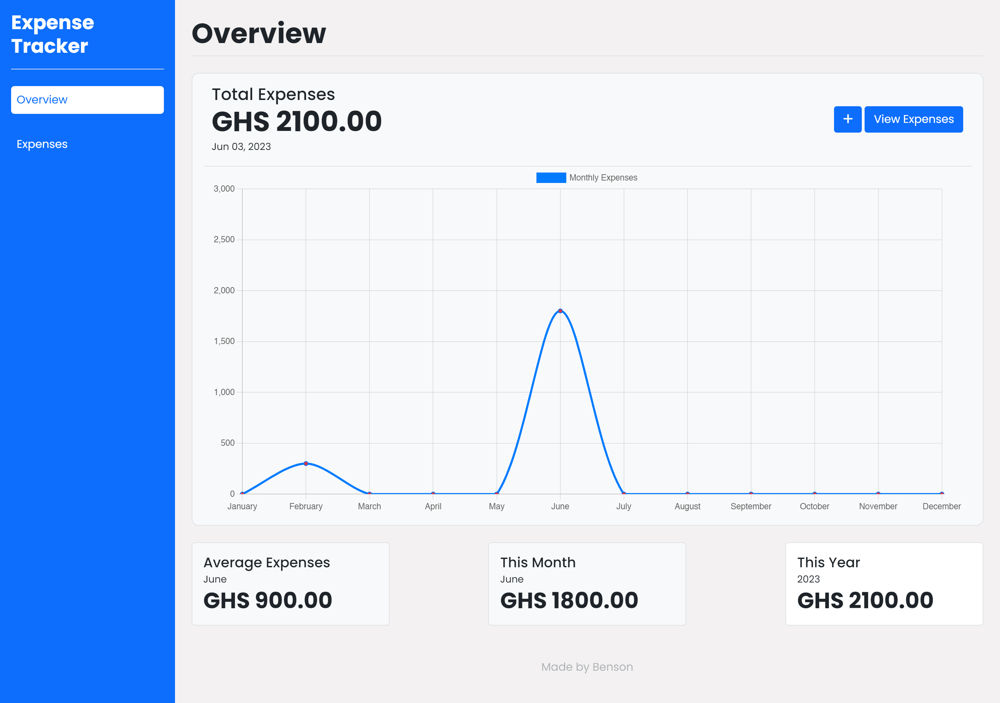
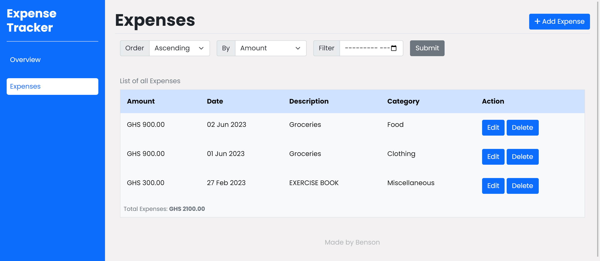
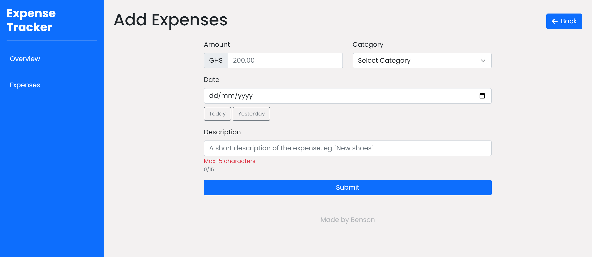

# Expense Tracker

Expense Tracker is a simple web application that helps you track and manage your expenses. It allows you to record your expenses, categorize them, and view your spending patterns over time.

## Features

- Add, edit, and delete expenses
- Categorize expenses into different categories (e.g., food, transportation, entertainment)
- View expenses by category and month
- Generate reports and visualize spending patterns
- User-friendly interface and intuitive controls

## Technologies Used

- PHP: Backend language for server-side logic
- MySQL: Database management system for storing expense data
- HTML/CSS: Frontend markup and styling
- JavaScript: Client-side scripting for dynamic functionality
- Bootstrap: CSS framework for responsive design
- Chart.js: JavaScript library for generating charts and graphs

## Installation

1. Clone the repository:

    ```bash
    git clone https://github.com/Namibra-Devs/expense-tracker.git
    ```

2. Set up a local development environment with PHP and MySQL. You can use [XAMPP](https://www.apachefriends.org/index.html) or [MAMP](https://www.mamp.info/en/) to get started.

3. Import the [SQL schema](database/expense-tracker.sql) to create the required database tables.

4. Configure the database connection in the [`config.php`](config.php) file.

5. Start the local development server. If you are using XAMPP, you can start the Apache and MySQL servers from the XAMPP control panel. If you are using MAMP, you can start the servers from the MAMP control panel. Alternatively, you can use the PHP development server:

    ```bash
    php -S localhost:8000
    ```

6. All helper functions are defined in the [`auxiliaries.php`](auxiliaries.php) file. You can add your own helper functions in this file.

7. Open the app in your web browser.

## Usage

1. There is no need to sign up or log in. Simply start adding your expenses on the `Expense` page.
2. Add your expenses by providing the necessary details, such as amount, date, category, and description.
3. View and manage your expenses in the expense list.
4. Use the provided filters and search functionality to find specific expenses.
5. View your expenses summary on the `Overview` page.
6. Edit or delete your expenses as needed.

## Screenshots

Overview page:


Expenses page:


Add expense page:

